# TourPackage — Database Design

PostgreSQL schema for the travel agency platform. Source of truth is the Flyway migrations in
[`src/main/resources/db/migration`](../src/main/resources/db/migration); this document explains the
design decisions behind them. Verified end-to-end against PostgreSQL 14 and 16 — every migration
applies cleanly, and the constraints below were smoke-tested to actually reject bad data (not just
declared and hoped for).

## Contents

- [ER Diagram](#er-diagram)
- [Design Conventions](#design-conventions)
- [Entities](#entities)
- [Relationships](#relationships)
- [Indexing Strategy](#indexing-strategy)
- [Constraints](#constraints)
- [Migration Map](#migration-map)

## ER Diagram

```mermaid
erDiagram
    COUNTRIES ||--o{ CITIES : "has"
    COUNTRIES ||--o{ USERS : "nationality of"
    COUNTRIES ||--o{ TOUR_PACKAGES : "hosts"
    COUNTRIES ||--o{ BOOKING_TRAVELLERS : "nationality of"
    COUNTRIES ||--o{ TESTIMONIALS : "customer country"

    CITIES ||--o{ HOTELS : "located in"
    CITIES ||--o{ TOUR_PACKAGES : "located in"
    CITIES ||--o{ PACKAGE_ITINERARY : "visited on"

    ADMINS ||--o{ HOTELS : "created by"
    ADMINS ||--o{ TOUR_PACKAGES : "created by"
    ADMINS ||--o{ INQUIRIES : "assigned to"
    ADMINS ||--o{ SETTINGS : "updated by"

    HOTELS ||--o{ HOTEL_IMAGES : "has"
    HOTELS ||--o{ HOTEL_AMENITIES : "has"
    AMENITIES ||--o{ HOTEL_AMENITIES : "listed via"
    HOTELS ||--o{ HOTEL_ROOMS : "offers"
    ROOM_TYPES ||--o{ HOTEL_ROOMS : "categorizes"
    HOTEL_ROOMS ||--o{ BOOKINGS : "booked as (HOTEL)"

    TOUR_PACKAGES ||--o{ PACKAGE_ITINERARY : "has"
    TOUR_PACKAGES ||--o{ PACKAGE_IMAGES : "has"
    TOUR_PACKAGES ||--o{ PACKAGE_INCLUDES : "has"
    TOUR_PACKAGES ||--o{ PACKAGE_EXCLUDES : "has"
    TOUR_PACKAGES ||--o{ BOOKINGS : "booked as (PACKAGE)"
    TOUR_PACKAGES ||--o{ INQUIRIES : "asked about"
    TOUR_PACKAGES ||--o{ TESTIMONIALS : "reviewed via"

    USERS ||--o{ BOOKINGS : "makes"
    USERS ||--o{ INQUIRIES : "submits"
    USERS ||--o{ TESTIMONIALS : "writes"

    BOOKINGS ||--o{ BOOKING_TRAVELLERS : "has"
    BOOKINGS ||--o{ BOOKING_PAYMENTS : "has"

    COUNTRIES {
        uuid id PK
        varchar name
        varchar iso2 UK
        varchar iso3 UK
    }
    CITIES {
        uuid id PK
        uuid country_id FK
        varchar name
        varchar slug
    }
    ADMINS {
        uuid id PK
        varchar email UK
        varchar password_hash
        varchar role
    }
    USERS {
        uuid id PK
        varchar email UK
        varchar password_hash "nullable, OAuth-ready"
        varchar status
    }
    AMENITIES {
        uuid id PK
        varchar name UK
        varchar category
    }
    ROOM_TYPES {
        uuid id PK
        varchar name UK
        smallint max_occupancy
    }
    HOTELS {
        uuid id PK
        uuid city_id FK
        varchar slug
        varchar status
        numeric base_price
    }
    HOTEL_IMAGES {
        uuid id PK
        uuid hotel_id FK
        text url
        bool is_cover
    }
    HOTEL_AMENITIES {
        uuid id PK
        uuid hotel_id FK
        uuid amenity_id FK
    }
    HOTEL_ROOMS {
        uuid id PK
        uuid hotel_id FK
        uuid room_type_id FK
        numeric price_per_night
        int total_rooms
    }
    TOUR_PACKAGES {
        uuid id PK
        uuid country_id FK
        uuid city_id FK
        varchar slug
        numeric price
        varchar status
    }
    PACKAGE_ITINERARY {
        uuid id PK
        uuid package_id FK
        smallint day_number
        uuid city_id FK
    }
    PACKAGE_IMAGES {
        uuid id PK
        uuid package_id FK
        text url
        bool is_cover
    }
    PACKAGE_INCLUDES {
        uuid id PK
        uuid package_id FK
        varchar description
    }
    PACKAGE_EXCLUDES {
        uuid id PK
        uuid package_id FK
        varchar description
    }
    BOOKINGS {
        uuid id PK
        varchar booking_number UK
        uuid user_id FK
        varchar booking_type
        uuid package_id FK "nullable"
        uuid hotel_room_id FK "nullable"
        varchar status
    }
    BOOKING_TRAVELLERS {
        uuid id PK
        uuid booking_id FK
        varchar full_name
        bool is_lead_traveller
    }
    BOOKING_PAYMENTS {
        uuid id PK
        uuid booking_id FK
        numeric amount
        varchar status
        varchar transaction_id UK
    }
    INQUIRIES {
        uuid id PK
        uuid user_id FK "nullable"
        uuid package_id FK "nullable"
        uuid assigned_to FK "nullable"
        varchar status
    }
    TESTIMONIALS {
        uuid id PK
        uuid user_id FK "nullable"
        uuid package_id FK "nullable"
        smallint rating
    }
    CONTACTS {
        uuid id PK
        varchar email
        varchar status
    }
    NEWSLETTER_SUBSCRIBERS {
        uuid id PK
        varchar email UK
        bool is_active
    }
    BANNERS {
        uuid id PK
        text image_url
        int display_order
    }
    FAQS {
        uuid id PK
        varchar question
        varchar category
    }
    SETTINGS {
        uuid id PK
        varchar key UK
        text value
        uuid updated_by FK "nullable"
    }
```

`CONTACTS`, `NEWSLETTER_SUBSCRIBERS`, `BANNERS`, and `FAQS` have no foreign keys — they're
standalone content/lead tables — so they're omitted from the relationship list above but included
in the diagram for completeness.

## Design Conventions

These apply uniformly across all 25 tables so any engineer can predict a column's shape without
opening the migration file.

- **UUID primary keys**, generated with `gen_random_uuid()` (pgcrypto, enabled in `V1__init.sql`).
  Chosen over `BIGSERIAL` because IDs are exposed in public URLs (`/packages/{id}`) and API
  responses — sequential integers leak record counts and invite enumeration attacks; UUIDs don't.
  They also let the application (or a future event queue) generate an ID before the row is
  persisted, and merge cleanly across environments without ID collisions.
- **`created_at` / `updated_at`** on every mutable table, both `TIMESTAMPTZ NOT NULL DEFAULT now()`.
  `updated_at` is maintained by a shared trigger (`set_updated_at()`, defined once in `V2`) rather
  than relying on the application layer, so it stays correct even for direct SQL, admin tooling, or
  a future batch job.
  Pure log/event tables (`hotel_amenities`, `package_includes`/`excludes`, `booking_travellers`'
  create-only fields) skip `updated_at` where rows are genuinely immutable once inserted.
- **Soft-delete only where records have a real lifecycle after "deletion"**: `users`, `hotels`, and
  `tour_packages` use `deleted_at` because a booking or itinerary can still reference a
  discontinued hotel/package/account, and the UI needs to keep rendering historical bookings.
  Everything else (lookups, media, content) uses hard deletes or an `is_active` flag, whichever
  fits how admins actually manage that entity — flip `is_active` for something that gets
  re-enabled (amenities, room types, FAQs), hard-delete for something that doesn't (a single
  banner or FAQ entry admins remove outright).
- **Money as `NUMERIC(12,2)`**, never `FLOAT`/`DOUBLE` — floating point cannot represent currency
  exactly and produces off-by-a-cent bugs under aggregation. Every monetary table also carries its
  own `currency_code CHAR(3)` rather than assuming a single global currency.
- **Status/type fields are `VARCHAR` + `CHECK`, not native Postgres `ENUM`.** Native enums require
  `ALTER TYPE ... ADD VALUE` (which can't run inside a transaction in older Postgres, and can't be
  removed at all) every time the business adds a status. A `CHECK` constraint is replaced in a
  normal transactional migration, and maps directly to a Java `enum` via
  `@Enumerated(EnumType.STRING)` without extra Hibernate configuration.
- **`slug` columns** are lowercase-kebab-case (enforced by a `CHECK ... ~ '^[a-z0-9]+(-[a-z0-9]+)*$'`
  regex) so they're usable directly in URLs without further sanitization.
- **Generated `search_vector tsvector` columns** on `hotels` and `tour_packages` (`GENERATED ALWAYS
  AS (...) STORED`, weighted A/B/C across title/summary/description). Postgres keeps these in sync
  automatically — there's no risk of the index going stale because someone's UPDATE forgot to also
  update a denormalized search column.
- **Email columns are plain `VARCHAR`, not `citext`.** `citext` was the original choice for
  case-insensitive lookups, but Hibernate's PostgreSQL dialect doesn't recognize it under
  `ddl-auto=validate` (`wrong column type ... found [citext], expecting [varchar]`) — it would
  break schema validation for every entity with an email field. Case-insensitivity is instead
  handled by lowercasing at the application layer before every read/write (see
  `AuthService`/`Admin` entity), with the uniqueness constraint on the already-normalized column.
- **Fixed-length codes (`iso2`, `iso3`, `currency_code`) are `VARCHAR(n)`, not `CHAR(n)`.** Same
  root cause as the `citext` note above: a plain `String` field maps to Hibernate's default
  `VARCHAR`, and `ddl-auto=validate` rejects the mismatch against Postgres's `CHAR`/`bpchar`
  (`found [bpchar], expecting [varchar]`) — caught the same way, by actually booting the app
  against the migrated schema rather than trusting the DDL in isolation. `CHAR`'s blank-padding
  behavior wasn't being used for anything here anyway (these are exact 2-3 character codes, always
  written at full length), so `VARCHAR(n)` loses nothing.

## Entities

| Table | Purpose |
|---|---|
| `countries` | Reference list of countries (ISO2/ISO3, currency, phone code) |
| `cities` | Cities, scoped to a country; anchor for hotels, packages, itinerary stops |
| `admins` | Back-office staff accounts (separate from `users` — different auth/attributes) |
| `users` | Public customer accounts; password nullable for future OAuth |
| `amenities` | Master catalogue of amenities (Free WiFi, Pool, ...) shared across hotels |
| `room_types` | Master catalogue of room categories (Standard, Deluxe, Suite, ...) |
| `hotels` | Sellable hotel listings |
| `hotel_images` | Hotel photo gallery, ordered, with one designated cover image |
| `hotel_amenities` | Join table: which amenities a given hotel offers |
| `hotel_rooms` | Bookable room products within a hotel (price, capacity, inventory count) |
| `tour_packages` | Sellable tour packages |
| `package_itinerary` | Day-by-day itinerary entries for a package |
| `package_images` | Package photo gallery, ordered, with one designated cover image |
| `package_includes` | "What's included" line items |
| `package_excludes` | "What's excluded" line items |
| `bookings` | A customer's purchase of either a package or a hotel room |
| `booking_travellers` | Traveller manifest for a booking, with one designated lead traveller |
| `booking_payments` | Payment attempts/transactions against a booking (supports partial/installment payments) |
| `inquiries` | "Ask about this package" leads, optionally tied to a package/user, assignable to an admin |
| `contacts` | General "Contact Us" form submissions |
| `newsletter_subscribers` | Email newsletter opt-in list |
| `banners` | Homepage/marketing carousel slides, with an active date range |
| `testimonials` | Customer reviews, optionally tied to a package/user |
| `faqs` | Frequently asked questions, grouped by category |
| `settings` | Generic key-value site configuration store |
| `blog_posts` | Editorial travel content (added in `V12`, not part of the original 24-entity design) |

## Relationships

- **`countries` → `cities`** (1:N, `RESTRICT`): a country can't be deleted while it still has
  cities — force the caller to reassign or delete cities first rather than silently orphaning
  hotels/packages built on top of them.
- **`cities` → `hotels`, `cities` → `tour_packages`** (1:N, `RESTRICT`): same reasoning — cities are
  foundational reference data that shouldn't disappear out from under live inventory.
- **`hotels` → `hotel_images`, `hotel_rooms`; `tour_packages` → `package_itinerary`,
  `package_images`, `package_includes`, `package_excludes`** (1:N, `CASCADE`): these are true
  compositions — a hotel image has no meaning without its hotel, so deleting the parent deletes
  the children.
- **`hotels` ↔ `amenities`** is many-to-many, resolved through `hotel_amenities`. Amenities are
  normalized into their own table (rather than a free-text column per hotel) so "Free WiFi" is one
  row referenced by every hotel that has it — renaming or re-icon-ing an amenity doesn't require
  updating every hotel row, and the admin UI can offer a picklist instead of free text.
- **`bookings` → `tour_packages` OR `hotel_rooms`**: a booking sells exactly one of the two.
  `booking_type` discriminates which FK is populated, enforced by `ck_bookings_type_target` (see
  [Constraints](#constraints)) rather than trusting the application to keep them in sync. Both FKs
  use `RESTRICT` — a package or room with existing bookings can't be deleted, only deactivated
  (`status = 'ARCHIVED'` / `is_active = false`), preserving booking history.
- **`bookings` → `booking_travellers`, `booking_payments`** (1:N, `CASCADE`): a booking's traveller
  manifest and payment history are meaningless without the booking; `booking_payments` is
  deliberately 1:N (not 1:1) to support partial/installment payments and payment retries after a
  failure.
- **`users`/`tour_packages` → `inquiries`/`testimonials`** are nullable FKs with `SET NULL`: an
  inquiry or testimonial can be submitted anonymously or without referencing a specific package,
  and if the linked user/package is later deleted, the lead or review itself is still worth
  keeping for records.
- **`admins` → `hotels.created_by`, `tour_packages.created_by`, `inquiries.assigned_to`,
  `settings.updated_by`**: all `SET NULL` on delete — losing the admin who created something
  shouldn't cascade into deleting the content itself.

## Indexing Strategy

Beyond the indexes Postgres creates automatically for `PRIMARY KEY` and `UNIQUE` constraints:

- **Every FK column has an explicit index** (`idx_cities_country_id`, `idx_hotels_city_id`,
  `idx_bookings_user_id`, etc.) — Postgres does *not* auto-index foreign keys (unlike some other
  databases), and every one of these is a join or filter path the API will hit constantly.
- **Partial indexes** where a query only ever cares about a subset of rows, so the index stays
  small and the planner favors it: `idx_hotels_featured` (`WHERE is_featured AND status =
  'PUBLISHED'`), `idx_countries_is_active`, `idx_newsletter_subscribers_is_active`, etc.
- **Composite indexes matching real access patterns**, not just single columns:
  - `idx_hotels_published_city_price` / `idx_tour_packages_published_city_price` on
    `(city_id, price)` — the public listing page's core query ("published items in this city,
    cheapest first").
  - `idx_bookings_user_status_created` on `(user_id, status, created_at DESC)` — the customer
    dashboard's "my bookings, optionally filtered by status, most recent first".
  - `idx_inquiries_status_created`, `idx_contacts_status_created` — the admin inbox view.
- **Full-text search** (`GIN` on the generated `search_vector` columns) for `hotels` and
  `tour_packages`, plus `pg_trgm` `GIN` indexes on `name`/`title` for fuzzy autocomplete-style
  matching that a plain B-tree can't serve.
- **Uniqueness-as-index** for real-world invariants that are also useful lookups: `uq_users_email_active`
  (partial — excludes soft-deleted rows, so a deleted account's email can be reused),
  `uq_hotels_slug_active` / `uq_tour_packages_slug_active` (same pattern), `uq_hotel_images_one_cover`
  / `uq_package_images_one_cover` (at most one cover image per hotel/package — a business rule
  enforced by the database, not application convention), `uq_booking_travellers_one_lead` (at most
  one lead traveller per booking).

## Constraints

Every constraint below was exercised against a live Postgres 14 instance with intentionally bad
inserts to confirm it actually rejects them (see the project's local test run — not just declared
and assumed correct):

- **Referential integrity**: every FK is either `RESTRICT` (reference/master data and anything
  with booking history — `countries`, `cities`, `tour_packages`, `hotel_rooms`) or `CASCADE`
  (true compositions — images, itinerary, includes/excludes, travellers, payments) or `SET NULL`
  (optional attribution — `created_by`, `assigned_to`, `updated_by`, and nullable links from
  `inquiries`/`testimonials` back to `users`/`tour_packages`). Nothing defaults to Postgres's
  implicit `NO ACTION`.
- **Domain checks** on every status/type/enum-like column (`ck_bookings_status`,
  `ck_admins_role`, `ck_booking_payments_method`, `ck_tour_packages_difficulty`, ...) so an invalid
  status can never be written even by hand-rolled SQL or a buggy migration.
- **Cross-column business rules** expressed as `CHECK` constraints rather than left to application
  code (which can be bypassed by a script, a bulk import, or a future service):
  - `ck_bookings_type_target` — `booking_type = 'PACKAGE'` requires `package_id` set and
    `hotel_room_id` null, and vice versa.
  - `ck_bookings_cancellation` — `cancelled_at` is set if and only if `status = 'CANCELLED'`.
  - `ck_booking_payments_paid_at` — `paid_at` is required once `status = 'SUCCESS'`.
  - `ck_tour_packages_discount_price` — a discount price can never exceed the base price.
  - `ck_bookings_return_date` — return date can't precede the travel date.
  - `ck_newsletter_subscribers_active` — `unsubscribed_at` is set if and only if `is_active = false`.
- **Range checks** on anything with real-world bounds: `star_rating BETWEEN 1 AND 5`,
  `rating BETWEEN 1 AND 5` (testimonials), `latitude BETWEEN -90 AND 90` /
  `longitude BETWEEN -180 AND 180`, all monetary/count columns `>= 0`.
- **Format checks** via regex: ISO country codes (`^[A-Z]{2}$` / `^[A-Z]{3}$`), currency codes
  (`^[A-Z]{3}$`), slugs (`^[a-z0-9]+(-[a-z0-9]+)*$`).
- **Uniqueness** beyond obvious natural keys (`email`, `slug`, `booking_number`): scoped uniqueness
  like `(country_id, slug)` on cities (two countries can each have a city slugged `springfield`),
  `(hotel_id, name)` on rooms, `(package_id, day_number)` on itinerary entries.

## Migration Map

| File | Contents |
|---|---|
| `V1__init.sql` | `pgcrypto` extension (UUID generation) |
| `V2__extensions_and_shared_functions.sql` | `pg_trgm`, `set_updated_at()` trigger function, `booking_reference_seq` |
| `V3__geography.sql` | `countries`, `cities` |
| `V4__identity.sql` | `admins`, `users` |
| `V5__hotels.sql` | `amenities`, `room_types`, `hotels`, `hotel_images`, `hotel_amenities`, `hotel_rooms` |
| `V6__tour_packages.sql` | `tour_packages`, `package_itinerary`, `package_images`, `package_includes`, `package_excludes` |
| `V7__bookings.sql` | `bookings`, `booking_travellers`, `booking_payments` |
| `V8__engagement.sql` | `inquiries`, `contacts`, `newsletter_subscribers` |
| `V9__content.sql` | `banners`, `testimonials`, `faqs`, `settings` |
| `V10__auth_tokens.sql` | `admins.email_verified_at`, `refresh_tokens`, `password_reset_tokens`, `email_verification_tokens` |
| `V11__seed_bootstrap_admin.sql` | Seeds one pre-verified `SUPER_ADMIN` (`admin@tourpackage.com`) |
| `V12__blog_and_destination_media.sql` | `cities.image_url`, `blog_posts` |
| `V13__seed_demo_content.sql` | Demo homepage content: countries, cities, hotels, tour packages, testimonials, FAQs, banners, blog posts, public settings |

Files are ordered by dependency: lookups first, then the entities that reference them, then the
transactional tables (`bookings`) that reference *those*, then standalone content/lead tables last.
